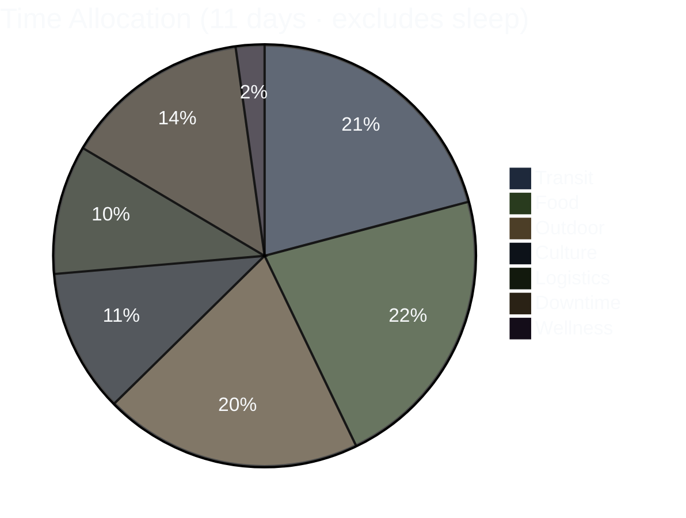
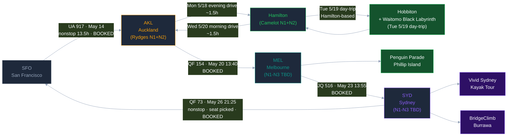

# AKL → Hamilton → MEL → SYD · May 2026

> **[→ Open Interactive Trip Dashboard](https://allstoncodes.github.io/nz-aus-2026)** — day-by-day timeline, per-day Leaflet map, hotel info, booking checklist with click-through URLs, real-time weather widget, persistent localStorage checkboxes, Pre-Trip Alert banner

*For Allston + Donnie's eyes. Repo goes private after May 26 return.*

**Last update:** 2026-05-12 — **Tue 5/19 BIG-day items both BOOKED** (Hobbiton 9:50am Ref #3242461 + Black Labyrinth 3:30pm Order Ref WTOMO-4130846 · $653.72 NZD total on Venture X). Site verification pass caught 4 brief errors (Hobbiton 9:30 fully booked → 9:20→9:50 pivot · Black Lab no 15:00 slot → 15:30 · Mudbrick no 11:00 → 11:30 · SeaLink terminal Mātiatia → Kennedy Point). NEW Booking Quick Links panel at top of dashboard (6 BOOK NOW buttons with status flags). NEW Pre-Trip Alert banner for BWR Risk Disclosure form (Wed 5/13 deadline).

## Booking status snapshot (2026-05-12)

| Item | Status | Ref / Action |
|---|---|---|
| ✈️ UA 917 SFO→AKL (outbound) | ✅ BOOKED | both travelers same flight LW459T |
| ✈️ QF 154 AKL→MEL | ✅ BOOKED | Cap One Travel |
| ✈️ JQ 516 MEL→SYD | ✅ BOOKED | Starter Plus |
| ✈️ QF 73 SYD→SFO (return) | ✅ BOOKED | YBKAZV |
| 🏨 Rydges Auckland N1+N2 | ✅ BOOKED | Ref 1001374794 · $239.52 USD refundable |
| 🏨 Camelot on Ulster Hamilton N1+N2 | ✅ BOOKED | Booking ID 1002183066 · $208.23 USD refundable |
| 🎬 Hobbiton Tue 5/19 9:50am | ✅ BOOKED 2026-05-12 | **Ref #3242461 · $260 NZD** |
| 🕳️ Black Labyrinth Tue 5/19 3:30pm | ✅ BOOKED 2026-05-12 | **Order Ref WTOMO-4130846 · $393.72 NZD** |
| 🍽️ Mudbrick Sun 5/17 11:30am lunch | ⏳ Pending | book at nz6.eveve.com Eveve widget |
| ⛴️ SeaLink Sun 5/17 ~09:30 Kennedy Point | ⏳ Pending (phone) | +64-9-300-5900 or sealink.co.nz |
| 🏉 All Blacks Mon 5/18 2:00pm | ⏳ Pending | book.experienceallblacks.com (5+ seats) |
| 📚 Auckland Writers Festival Sat 5/16 | ⏳ Session pick required | 4:00pm or 5:30pm block (no 16:45) |

## ⚠️ Pre-trip action (Wed 5/13 deadline)

**BWR Risk Disclosure form** — both Allston + Donnie must complete separately before Tue 5/19 tour. Discover Waitomo sent the form link with the Black Lab booking confirmation email. ~5 min each. Saves 10-15 min at BWR base check-in.

---

Supplementary Mermaid + ASCII visualizations of the 11-day trip. Primary visual is the interactive HTML dashboard at the link above.

---

## 1. Trip Arc — Gantt Overview

```mermaid
%%{init: {'theme':'dark'}}%%
gantt
    dateFormat  YYYY-MM-DD
    title       AKL to Hamilton to MEL to SYD - May 2026
    axisFormat  %b %d

    section Outbound
    UA 917 SFO to AKL                     :done,    f0, 2026-05-14, 2d

    section Auckland (Rydges N1+N2)
    Day 1 - Arrival, War Museum, Writers  :done,    a1, 2026-05-16, 1d
    Day 2 - Fullers Cruise full day       :done,    a2, 2026-05-17, 1d

    section Hamilton (Camelot N1+N2)
    Day 3 - AKL flex, All Blacks, drive   :done,    h1, 2026-05-18, 1d
    Day 4 - Hobbiton + Black Labyrinth    :done,    h2, 2026-05-19, 1d

    section Hamilton to AKL airport to MEL
    Day 5 - Drive AKL airport, QF 154     :done,    f1, 2026-05-20, 1d

    section Melbourne (MEL N1-N3 placeholder)
    Day 6 - Penguin Parade Kennett koalas :crit,    m1, 2026-05-21, 1d
    Day 7 - Aussie friends meetup MEL N3  :crit,    m2, 2026-05-22, 1d

    section MEL to SYD then Sydney + Vivid
    Day 8 - JQ 516, Vivid Sydney start    :crit,    s1, 2026-05-23, 1d
    Day 9 - BridgeClimb Burrawa, Bondi    :crit,    s2, 2026-05-24, 1d
    Day 10 - Memorial Day Symbio          :crit,    s3, 2026-05-25, 1d

    section Return
    QF 73 SYD to SFO 21:25 to 17:45       :done,    f3, 2026-05-26, 1d
```

---

## 2. Activity Distribution — Pie Breakdown



---

## 3. Route Flowchart



---

## 4. ASCII Timeline (compact fallback)

Each row = 1 day, 20 characters spanning 24 hours (~1.2h per char). Category key below.

```
       0  4  8  12 16 20 24
       -  -  -  -  -  -  -
May14  ....LLLLL.....LLLTTT  SFO  - Departure Day (UA 917 dep 22:45)
May15  TTTTTTTTTTTTTTTTTTTT  Pac  - In-flight over Pacific (13h25m UA 917)
May16  ..LLTFFCCCCFFFFCCFFDS  AKL  - Arrival - War Museum - Writers Festival - sleep Rydges N1
May17  ..FOOOOOOOOOOOOFFFFDS  AKL  - Fullers Cruise full day walk-on - sleep Rydges N2
May18  ..LLLDDFCCCCCCTTLLDDS  HAM  - AKL flex (All Blacks Experience + Mt Eden) - drive Hamilton evening - sleep Camelot N1
May19  ..FTTOOOOFTTOOOOTTTDS  HAM  - Hobbiton AM - Black Labyrinth PM - drive Hamilton - sleep Camelot N2
May20  ..FLTTLLLLLDDFFCCFFDS  AKL>MEL transit - QF 154 13:40 - check in MEL
May21  ..FOOOOOFFFOOOOOOFLDS  MEL  - Penguin Parade - Kennett River koalas (Thu 5/21 placeholders)
May22  ..FFFCCCDDFFCCFFFFTTL  MEL  - Aussie friends meetup - sleep MEL N3
May23  ..FFFLTTLLDFCCFCFCFLD  MEL>SYD transit - JQ 516 13:55 - Vivid Sydney evening
May24  ..FOOTTLLFFCWWWFTLCDS  SYD  - BridgeClimb Burrawa or Bondi-Coogee
May25  ..FFFCCCFFFLOFFFDDDDS  SYD  - Memorial Day Symbio Wildlife
May26  ..FFFCCCFFFLLLTTTTTT  SYD>SFO QF 73 dep 21:25 (evening - lands SFO 17:45 same day)

KEY:  T=transit  O=outdoor  F=food  C=culture  W=wellness
      L=logistics  D=downtime  S=sleep  .=midnight buffer
```

---

## 5. Flight Legs Summary — All BOOKED ✓

| Leg | Flight | Date | Dep → Arr | Status |
|---|---|---|---|---|
| SFO → AKL | UA 917 | May 14 | 22:45 → 07:10+2 | **BOOKED ✓** $971 Basic Economy |
| AKL → MEL | QF 154 | May 20 | 13:40 → 15:50 (4h10m nonstop) | **BOOKED ✓** Economy Sale, Cap One Travel |
| MEL → SYD | JQ 516 | May 23 | 13:55 → 15:20 (1h25m nonstop) | **BOOKED ✓** Starter Plus, Cap One Travel |
| SYD → SFO | QF 73 | May 26 | 21:25 → 17:45 (same day, gain a day) | **BOOKED ✓** code YBKAZV, ticket 0742138056542, seat picked |

---

## 6. Hotel Bookings — NZ leg complete ✓

| City | Hotel | Nights | Total | Status |
|---|---|---|---|---|
| Auckland | **Rydges Auckland** (Federal & Kingston St CBD) | Sat 5/16 + Sun 5/17 | $239.52 USD refundable | **BOOKED ✓** ID 1001374794 · cancel May 15 |
| Hamilton | **Camelot on Ulster** (231 Ulster St, Whitiora) | Mon 5/18 + Tue 5/19 | $208.23 USD refundable | **BOOKED ✓** ID 1002183066 · cancel May 16 |
| Melbourne | TBD | Wed 5/20 + Thu 5/21 + Fri 5/22 | placeholder | re-plan after NZ |
| Sydney | TBD (Hilton Sydney for Sat 5/23 Surpass cert is the lead) | Sat 5/23 + Sun 5/24 + Mon 5/25 | placeholder | re-plan after NZ |

---

## 7. City Split — Time Budget

| City | Days | Nights | Key Activities |
|---|---|---|---|
| Auckland | Sat–Sun 5/16–5/17 | 2 (Rydges) | War Museum · Writers Festival · Fullers Cruise full day walk-on |
| Auckland (Mon 5/18 morning + flex) | Mon 5/18 AM-PM | 0 (transition day) | All Blacks Experience · Mt Eden sunset · drive Hamilton evening |
| Hamilton | Mon–Tue 5/18–5/19 | 2 (Camelot) | Tue 5/19 = Hobbiton AM + Black Labyrinth PM (Hamilton-based day-trip) |
| Melbourne | Wed–Fri 5/20–5/22 | 3 (TBD) | Penguin Parade · Kennett River koalas · Aussie friends · Selena's eats |
| Sydney | Sat–Tue 5/23–5/26 | 3 (TBD) | Vivid Sydney · Opera House · BridgeClimb Burrawa · Bondi-Coogee · Symbio Wildlife (Corey + Jiho rec) |
| **Total** | **11 ground days** | **7 booked + 6 TBD** | NZ leg = self-drive AKL→Hamilton→Hobbiton→Waitomo loop (Donnie + IDP) |

---

## 8. NZ Leg Drive Math

| Day | Drive | Total |
|---|---|---|
| Mon 5/18 | AKL → Hamilton (evening, 18:00) | ~1.5h |
| Tue 5/19 | Hamilton → Hobbiton (1h) → Waitomo (2h) → Hamilton (1h) | ~4h round-trip |
| Wed 5/20 | Hamilton → AKL airport (09:00) | ~1.5h |
| **NZ leg total** | | **~7h** |

Engineered with "end-with-wet" order: Hobbiton chill morning → Black Labyrinth wet/cold finale → 1h drive home → Camelot hot shower + sleep. Black Labyrinth = 3h gentler version (5/8 pick over Black Abyss 5h for energy preservation).
