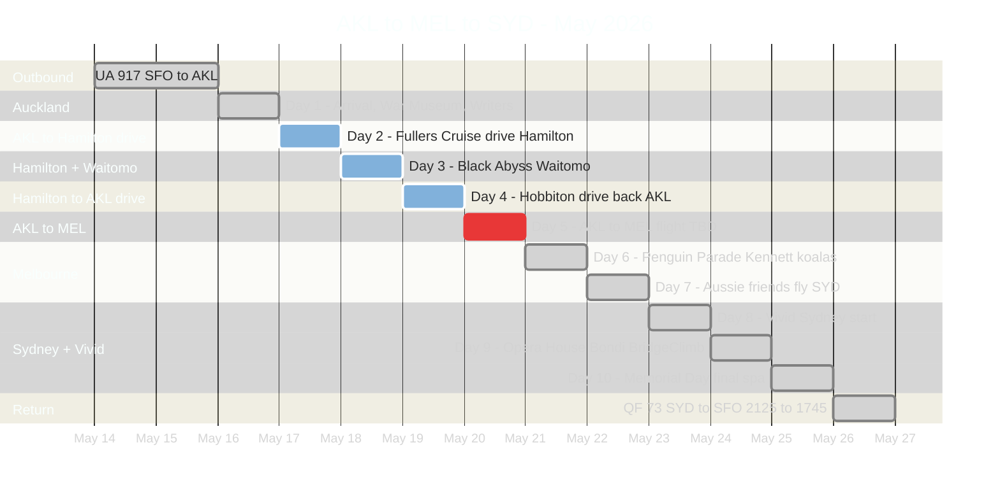
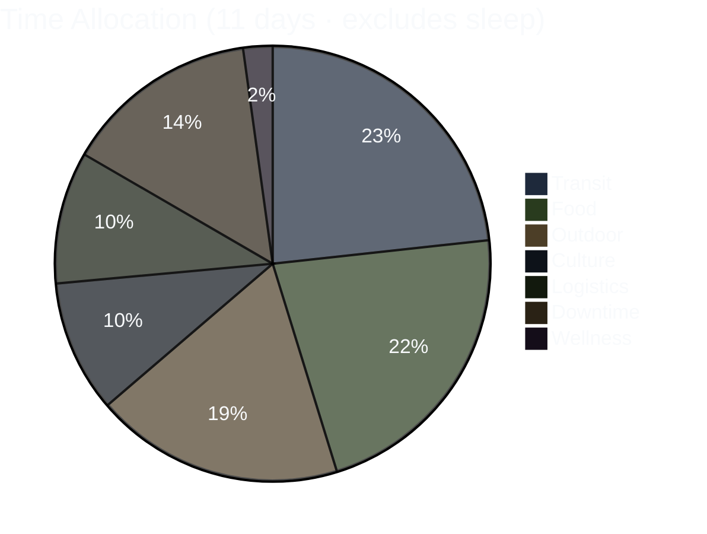
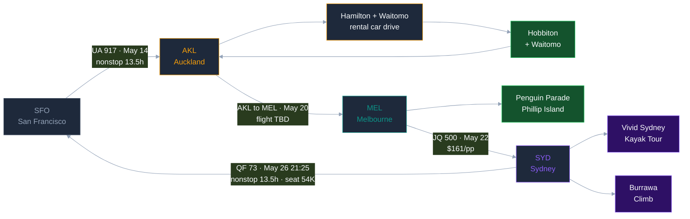

# AKL → Hamilton → MEL → SYD · May 2026

> **[→ Open Interactive Trip Dashboard](https://allstoncodes.github.io/nz-aus-2026)** — day-by-day timeline, per-day Leaflet map, hotel info, booking checklist (Hamilton + Waitomo + Hobbiton now included)

*For Allston + Donnie's eyes. Repo goes private after May 26 return.*

**Last update:** 2026-05-06 — restructured around GCal-aligned itinerary with Hamilton/Waitomo/Hobbiton self-drive leg + QF 73 evening return (booked).

---

Supplementary Mermaid + ASCII visualizations of the 11-day trip. Primary visual: the interactive HTML dashboard at the link above.

---

## 1. Trip Arc — Gantt Overview



---

## 2. Activity Distribution — Pie Breakdown



---

## 3. Route Flowchart



---

## 4. ASCII Timeline (compact fallback)

Each row = 1 day, 20 characters spanning 24 hours (~1.2h per char). Category key below.

```
       0  4  8  12 16 20 24
       -  -  -  -  -  -  -
May14  ....LLLLL.....LLLTTT  SFO  - Departure Day (flight dep 22:45)
May15  TTTTTTTTTTTTTTTTTTTT  Pac  - In-flight over Pacific (13h25m UA 917)
May16  ..LLTFFCCCCFFFFCCFFDS  AKL  - Arrival - War Museum - Writers Festival
May17  ..FOOOOOOOOOOOOTTLLDS  AKL  - Fullers Cruise - drive to Hamilton
May18  ..FFFLOOOOOOLLFFFLLDS  HAM  - Black Abyss Waitomo (5hr)
May19  ..FOOOOFFTTTFLLLDDDDS  HAM  - Hobbiton - drive back to AKL
May20  ..LTTTLLLLLDDFFCCFFDS  AKL>MEL transit - check in MEL
May21  ..FOOOOOFFFOOOOOOFLDS  MEL  - Penguin Parade - Kennett River koalas
May22  ..FFFCCCDDFFCCFFFFTTL  MEL>SYD - Aussie friends meetup - fly SYD evening
May23  ..FOOTTCCFFCCFCFCFLLD  SYD  - Vivid Sydney + Opera House
May24  ..FOOTTLLFFCWWWFTLCDS  SYD  - BridgeClimb Burrawa or Bondi-Coogee
May25  ..FFFCCCFFFLOFFFDDDDS  SYD  - Memorial Day final spa
May26  ..FFFCCCFFFLLLTTTTTT  SYD>SFO departure QF 73 dep 21:25 (evening red-eye, lands SFO 17:45 same day)

KEY:  T=transit  O=outdoor  F=food  C=culture  W=wellness
      L=logistics  D=downtime  S=sleep  .=midnight buffer
```

---

## 5. Flight Legs Summary

| Leg | Flight | Date | Dep → Arr | Per Person | Status |
|---|---|---|---|---|---|
| SFO → AKL | UA 917 | May 14 | 22:45 → 07:10+2 | $971 | **BOOKED ✓** |
| AKL → MEL | TBD | May 20 | ~09:45 → ~13:00 | TBD | **Re-search needed** (date moved from 5/19 → 5/20) |
| MEL → SYD | TBD | May 22 | evening per GCal | TBD | **Re-search needed** (was JQ 500 06:00; new GCal slots Aussie friends meetup until 21:15) |
| SYD → SFO | QF 73 | May 26 | 21:25 → 17:45 (same day, gain a day) · seat 54K | AUD $60 paid | **BOOKED ✓** (KLM partner) |

*Prices include 1 checked bag. Sourced via Fli MCP on 2026-05-03; QF 73 booked 2026-05-04.*

---

## 6. City Split — Time Budget

| City | Days | Nights | Key Activities |
|---|---|---|---|
| Auckland + Hamilton | Sat–Tue (5/16–5/19) | 3 (2 AKL + 1 Hamilton) | War Museum · Writers Festival · Fullers Cruise · Black Abyss Waitomo · Hobbiton |
| Melbourne (MEL) | Wed–Fri (5/20–5/22) | 2 | Penguin Parade · Kennett River koalas · Aussie friends · Selena's eats |
| Sydney (SYD) | Fri–Tue (5/22–5/26) | 4 | Vivid Sydney · Opera House · BridgeClimb Burrawa · Bondi-Coogee · Symbio Wildlife (Corey rec) |
| **Total** | **11 ground days** | **9** | Driving NZ leg adds rental car logistics (Donnie + IDP) |
