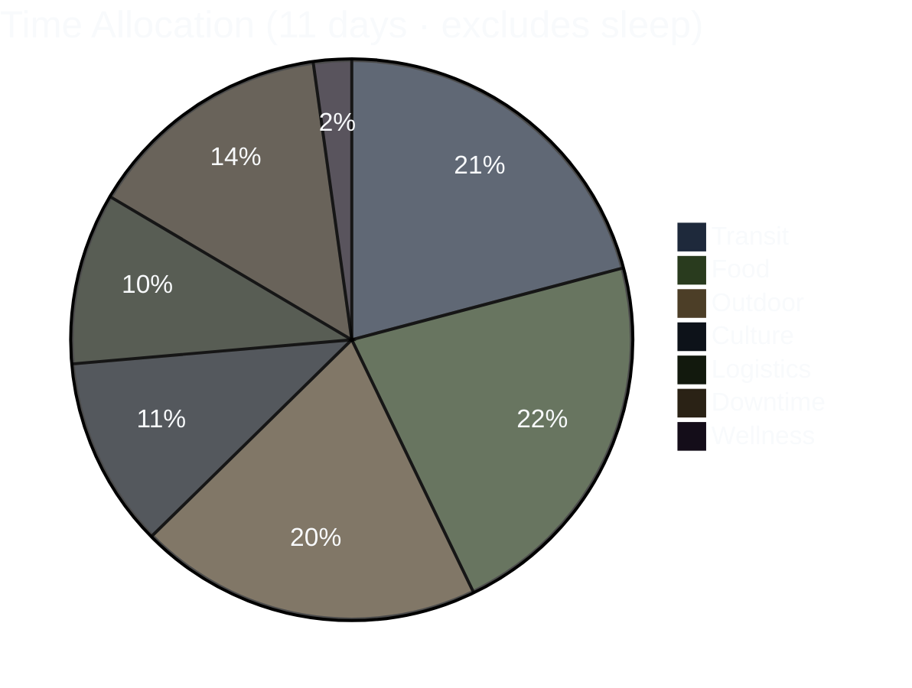
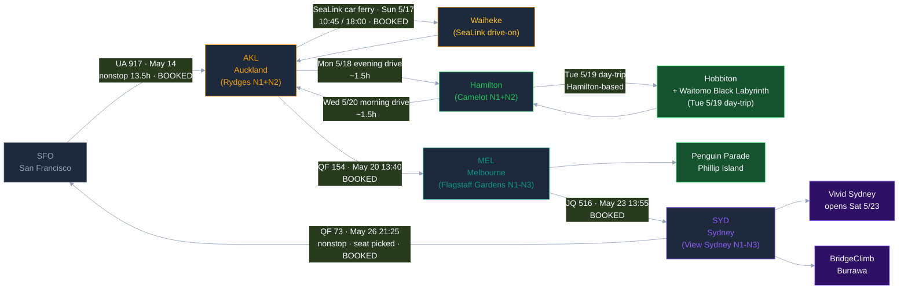

# AKL → Hamilton → MEL → SYD · May 2026

> **[→ Open Interactive Trip Dashboard](https://allstoncodes.github.io/nz-aus-2026)** — day-by-day timeline, per-day Leaflet map, hotel info, booking checklist with click-through URLs, real-time weather widget (Open-Meteo, client-side fetch-time stamp), persistent localStorage checkboxes, Pre-Trip Alert banner.

*For Allston + Donnie's eyes. Repo goes private after May 26 return.*

**Last update:** 2026-05-14 — **ALL paid bookings COMPLETE · T-0 to UA 917 22:45 departure**. Final booking sprint closed out across 5/12–5/14: 7 paid bookings + Allston's BWR Risk Disclosure submitted + UA 917 boarding pass in Apple Wallet. Two day-of walk-up decisions deferred by design (Sky Tower, Haka). Allston duplicate bookings cancelled 5/12 ($653.72 NZD refund pending) — the trip uses Donnie's pre-existing Hobbiton (9:20) + Black Labyrinth (3:30) reservations. Mudbrick switched from Complete Experience to à la carte 12:30 for ferry-slack. Triple Combo abandoned for Individual Wētā + All Blacks tickets (time-slot certainty > $19 USD savings). Sat 5/16 reframed as chill day with only Writers Festival 4pm FREE locked.

## Booking status snapshot (2026-05-14)

| Item | Status | Ref / Cost |
|---|---|---|
| ✈️ UA 917 SFO→AKL (outbound) | ✅ BOOKED · checked in | both same flight LW459T · boarding pass in Apple Wallet |
| ✈️ QF 154 AKL→MEL | ✅ BOOKED | May 20 · 13:40 → 15:50 · Cap One Travel |
| ✈️ JQ 516 MEL→SYD | ✅ BOOKED | May 23 · 13:55 → 15:20 · Starter Plus |
| ✈️ QF 73 SYD→SFO (return) | ✅ BOOKED | May 26 · 21:25 → 17:45 same day · YBKAZV · seat picked |
| 🏨 Rydges Auckland N1+N2 | ✅ BOOKED | Ref 1001374794 · $239.52 USD refundable |
| 🏨 Camelot on Ulster Hamilton N1+N2 | ✅ BOOKED | Booking ID 1002183066 · $208.23 USD refundable |
| 🏨 Flagstaff Gardens MEL N1+N2+N3 | ✅ BOOKED 2026-05-13 | ID 1002950354 · 380 William St CBD · AUD 464.17 pay-at-hotel · breakfast incl. |
| 🏨 View Sydney N1+N2+N3 | ✅ BOOKED 2026-05-13 | ID 1003005966 · 17 Blue St North Sydney · USD 465.50 charged 5/18 Venture X 2499 |
| 🚗 Hertz Compact SUV AKL | ✅ BOOKED 2026-05-07 | $161 · Cap One CDW primary · Donnie drives w/ IDP |
| 🎬 Hobbiton Tue 5/19 9:20am | ✅ BOOKED by Donnie 2026-05-09 | **Ref #3241276** · $260 NZD on Donnie's GooglePay · Allston ~$130 owed via Splitwise |
| 🕳️ Black Labyrinth Tue 5/19 3:30pm | ✅ BOOKED by Donnie 2026-05-09 | **Ticket WTOMO-4130062-16471983** · paid by Donnie · Allston ~half-share owed |
| ⛴️ SeaLink car ferry Sun 5/17 10:45/18:00 | ✅ BOOKED 2026-05-13 | **Master Ref 2744408** · $418.78 NZD / $249.97 USD PAID Venture X Apple Pay |
| 🍽️ Mudbrick Restaurant à la carte Sun 5/17 12:30 | ✅ BOOKED 2026-05-13 | **Reservation CCLUS4B9G6Y** (SevenRooms) · 2-course $105pp / 3-course $125pp · pay-on-site · no deposit |
| 🎨 Wētā Workshop Unleashed Mon 5/18 11:10am | ✅ BOOKED 2026-05-13 | **Party Ref 1483637 · Booking #967070** · $134 NZD PAID Venture X · 88 Federal St Level 5 |
| 🏉 All Blacks Experience Mon 5/18 3:00pm | ✅ BOOKED 2026-05-13 | **Order 715560 · Booking ID 477348** · $138 NZD PAID Venture X · 50% off SkyCity parking validation |
| 📚 Writers Festival Event 81 Sat 5/16 4:00pm | ✅ LOCKED 2026-05-13 | Herald Theatre Aotea Centre · **FREE walk-in** · Migration & Motherhood |
| 🗼 Sky Tower Mon 5/18 ~1:30pm | 🟡 Walk-up day-of decision | $47/adult counter (same as online) · Space Needle equivalent · both on the fence |
| 🪶 Haka "Living Taonga" Sat 5/16 11am or 1:30pm | 🟡 Walk-up day-of decision | $124 NZD if going · daily 2× performance not scarce · Sat is chill day post-redeye |
| 📱 Airalo Oceania Regional eSIM | ⏳ Pre-flight today | both travelers separate purchases |
| 📋 GCal NZ/AU timezone conversion | ⏳ Pre-flight today | NZ → NZST UTC+12 · AU → AEST UTC+10 |

## ⚠️ Pre-trip status (T-0 · 2026-05-14)

**BWR Risk Disclosure form** — required before Tue 5/19 Black Labyrinth tour. ~5 min on phone. Saves 10-15 min at BWR base check-in.

- **Allston:** ✅ DONE 2026-05-14 07:46 UTC · Doc V8oUwNVRch22irLscmogeC
- **Donnie:** ⏳ pending · Allston texted form link 5/14 morning · link is in Donnie's 2026-05-09 Black Lab confirmation email (Order Ref WTOMO-4130062)

**Other pre-flight:**
- Activate Airalo Oceania Regional eSIM (both travelers, separate purchases)
- UA 917 upgrade decision (BE→E reprice OR miles OR accept BE)
- Convert GCal events from PST → NZST (NZ) / AEST (AU)
- Track $653.72 NZD Venture X refund (Hobbiton #3242461 + Black Lab WTOMO-4130846 duplicates cancelled 5/12)
- Final pack from `packing-list.md` for SFO 22:45 tonight

---

Supplementary Mermaid + ASCII visualizations of the 11-day trip. Primary visual is the interactive HTML dashboard at the link above.

---

## 1. Trip Arc — Gantt Overview

```mermaid
%%{init: {'theme':'dark'}}%%
gantt
    dateFormat  YYYY-MM-DD
    title       AKL to Hamilton to MEL to SYD - May 2026
    axisFormat  %b %d

    section Outbound
    UA 917 SFO to AKL                          :done,    f0, 2026-05-14, 2d

    section Auckland (Rydges N1+N2)
    Day 1 - Arrival + chill + Writers Fest 4pm :done,    a1, 2026-05-16, 1d
    Day 2 - SeaLink Waiheke + Mudbrick a la carte :done, a2, 2026-05-17, 1d

    section Hamilton (Camelot N1+N2)
    Day 3 - Weta + All Blacks + Mt Eden + drive :done,   h1, 2026-05-18, 1d
    Day 4 - Hobbiton + Black Labyrinth         :done,    h2, 2026-05-19, 1d

    section Hamilton to AKL airport to MEL
    Day 5 - Drive AKL airport, QF 154 13:40    :done,    f1, 2026-05-20, 1d

    section Melbourne (Flagstaff Gardens N1-N3)
    Day 6 - Penguin Parade + Kennett koalas    :active,  m1, 2026-05-21, 1d
    Day 7 - MEL CBD chill + Aussie friends     :active,  m2, 2026-05-22, 1d

    section MEL to SYD then Sydney + Vivid (View Sydney N1-N3)
    Day 8 - JQ 516 + Vivid Sydney evening      :active,  s1, 2026-05-23, 1d
    Day 9 - BridgeClimb Burrawa + Bondi-Coogee :active,  s2, 2026-05-24, 1d
    Day 10 - Memorial Day Symbio Wildlife      :active,  s3, 2026-05-25, 1d

    section Return
    QF 73 SYD to SFO 21:25 to 17:45            :done,    f3, 2026-05-26, 1d
```

---

## 2. Activity Distribution — Pie Breakdown



---

## 3. Route Flowchart



---

## 4. ASCII Timeline (compact fallback)

Each row = 1 day, 20 characters spanning 24 hours (~1.2h per char). Category key below.

```
       0  4  8  12 16 20 24
       -  -  -  -  -  -  -
May14  ....LLLLL.....LLLTTT  SFO  - Departure Day (UA 917 dep 22:45)
May15  TTTTTTTTTTTTTTTTTTTT  Pac  - In-flight over Pacific (13h25m UA 917)
May16  ..LLTCCCCFFCCCCCCFFDS  AKL  - Arrival - chill day - Writers Festival 4pm FREE - sleep Rydges N1
May17  ..FFLTTFFFFFOOOOOTTDS  AKL  - SeaLink Waiheke drive-on - Mudbrick a la carte - Onetangi - Oneroa - sleep Rydges N2
May18  ..FFLTCCFCCCCCTTOOLTS  HAM  - Weta + Sky Tower walk-up + All Blacks + Mt Eden sunset - drive Hamilton - sleep Camelot N1
May19  ..FTTOOOOFTTOOOOOTLDS  HAM  - Hobbiton 9:20 - Black Labyrinth 3:30 - drive Hamilton - sleep Camelot N2
May20  ..FLTTLLLLLDDFFCCFFDS  AKL>MEL transit - QF 154 13:40 - Flagstaff Gardens check-in
May21  ..FOOOOOFFFOOOOOOFLDS  MEL  - Penguin Parade - Kennett River koalas
May22  ..FFFCCCDDFFCCFFFFTTL  MEL  - CBD chill - Aussie friends meetup - sleep Flagstaff N3
May23  ..FFFLTTLLDFCCFCFCFLD  MEL>SYD transit - JQ 516 13:55 - Vivid Sydney evening - View Sydney
May24  ..FOOTTLLFFCWWWFTLCDS  SYD  - BridgeClimb Burrawa + Bondi-Coogee Coastal Walk
May25  ..FFFCCCFFFLOFFFDDDDS  SYD  - Memorial Day Symbio Wildlife (quokkas)
May26  ..FFFCCCFFFLLLTTTTTT  SYD>SFO QF 73 dep 21:25 (evening - lands SFO 17:45 same day)

KEY:  T=transit  O=outdoor  F=food  C=culture  W=wellness
      L=logistics  D=downtime  S=sleep  .=midnight buffer
```

---

## 5. Flight Legs Summary — All BOOKED ✓

| Leg | Flight | Date | Dep → Arr | Status |
|---|---|---|---|---|
| SFO → AKL | UA 917 | May 14 | 22:45 → 07:10+2 | **BOOKED ✓ · checked in** $971 Basic Economy |
| AKL → MEL | QF 154 | May 20 | 13:40 → 15:50 (4h10m nonstop) | **BOOKED ✓** Economy Sale, Cap One Travel |
| MEL → SYD | JQ 516 | May 23 | 13:55 → 15:20 (1h25m nonstop) | **BOOKED ✓** Starter Plus, Cap One Travel |
| SYD → SFO | QF 73 | May 26 | 21:25 → 17:45 (same day, gain a day) | **BOOKED ✓** code YBKAZV, ticket 0742138056542, seat picked |

---

## 6. Hotel Bookings — ALL BOOKED ✓

| City | Hotel | Nights | Total | Status |
|---|---|---|---|---|
| Auckland | **Rydges Auckland** (Federal & Kingston St CBD) | Sat 5/16 + Sun 5/17 | $239.52 USD refundable | **BOOKED ✓** ID 1001374794 |
| Hamilton | **Camelot on Ulster** (231 Ulster St, Whitiora) | Mon 5/18 + Tue 5/19 | $208.23 USD refundable | **BOOKED ✓** ID 1002183066 |
| Melbourne | **Flagstaff Gardens Hotel** (380 William St CBD · 4★ 8.5) | Wed 5/20 + Thu 5/21 + Fri 5/22 | AUD 464.17 pay-at-hotel (~$305-310 USD) · breakfast incl. | **BOOKED ✓ 2026-05-13** ID 1002950354 |
| Sydney | **View Sydney** (17 Blue St North Sydney NSW 2060 · 4★ 8.8 / 9,905 reviews) | Sat 5/23 + Sun 5/24 + Mon 5/25 | USD 465.50 charged 5/18 to Venture X 2499 · -$40.47 trip savings | **BOOKED ✓ 2026-05-13** ID 1003005966 |

*Sydney lodging note:* Hilton Honors Surpass weekend-night cert was DEBUNKED 2026-05-13 — cert never existed in Allston's account. Switched to Agoda direct booking on View Sydney.

---

## 7. City Split — Time Budget

| City | Days | Nights | Key Activities |
|---|---|---|---|
| Auckland | Sat–Sun 5/16–5/17 | 2 (Rydges) | Chill arrival day + Writers Festival 4pm FREE · SeaLink Waiheke drive-on + Mudbrick à la carte + Onetangi + Oneroa |
| Auckland (Mon 5/18 flex) | Mon 5/18 AM-PM | 0 (transition) | Wētā Workshop 11:10 · Sky Tower walk-up optional · All Blacks Experience 3:00pm · Mt Eden sunset · drive Hamilton evening |
| Hamilton | Mon–Tue 5/18–5/19 | 2 (Camelot) | Tue 5/19 = Hobbiton 9:20 + Black Labyrinth 3:30 (Hamilton-based day-trip · engineered end-with-wet) |
| Melbourne | Wed–Fri 5/20–5/22 | 3 (Flagstaff Gardens) | Penguin Parade · Kennett River koalas · Aussie friends meetup · Selena's eats |
| Sydney | Sat–Tue 5/23–5/26 | 3 (View Sydney) | Vivid Sydney · BridgeClimb Burrawa · Bondi-Coogee Coastal · Symbio Wildlife Memorial Day (Corey + Jiho rec) |
| **Total** | **11 ground days** | **13 nights booked** | NZ leg = self-drive AKL→Waiheke→AKL→Hamilton→Hobbiton/Waitomo→AKL airport (Donnie + IDP) |

---

## 8. NZ Leg Drive Math

| Day | Drive | Total |
|---|---|---|
| Sat 5/16 | AKL airport → CBD (~1hr) | ~1h |
| Sun 5/17 | SeaLink drive-on Waiheke (Auckland City Terminal Hamer St ↔ Kennedy Point) + on-island Mudbrick/Onetangi/Oneroa loop | ~30min on-island |
| Mon 5/18 | AKL CBD → Mt Eden → AKL → Hamilton (evening, 18:15) | ~1.75h |
| Tue 5/19 | Hamilton → Hobbiton (1h) → Waitomo (2h) → Hamilton (1h) | ~4h round-trip |
| Wed 5/20 | Hamilton → AKL airport (09:00) | ~1.5h |
| **NZ leg total** | | **~8.5h** |

Engineered "end-with-wet" order: Hobbiton chill morning → Black Labyrinth wet/cold finale → 1h drive home → Camelot hot shower + sleep. Black Labyrinth = 3h gentler version (5/8 pick over Black Abyss 5h for energy preservation).
