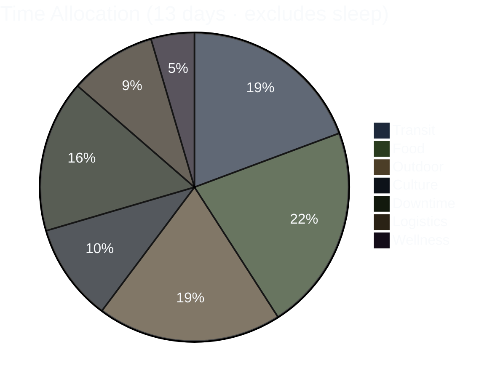
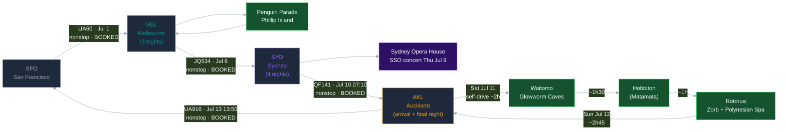

# SFO → Melbourne → Sydney → New Zealand · July 2026

> **[→ Open the Trip Site](https://allstoncodes.github.io/nz-aus-2026)** — **Itinerary** · **Full Itinerary** (rich day-by-day with interactive timeline, Leaflet map, live weather) · **At a Glance** · **Map & Places**.

*For Allston + Donnie's eyes.*

**Last update:** 2026-06-19 — **July rebuild · Option D.** Three legs: **Melbourne 3 nt (Jul 3–6) · Sydney 4 nt (Jul 6–10) · New Zealand 3 nt (Jul 10–13).** All four flights booked. Two locked anchors: **Penguin Parade** (Phillip Island, Sat Jul 4) and **Sydney Symphony Orchestra at the Opera House** (Thu Jul 9, 7 PM). NZ finale = Option D (relaxed Auckland arrival, then a Waitomo + Hobbiton south day, then Rotorua's Zorb + Polynesian Spa). Remaining hotels, the NZ rental car, and the NZ activity time-slots are Donnie's to book.

## Booking status snapshot (2026-06-19)

| Item | Status | Notes |
|---|---|---|
| ✈️ UA60 SFO→MEL (outbound) | ✅ BOOKED | Wed Jul 1 11:20 PM → Fri Jul 3 8:15 AM |
| ✈️ JQ534 MEL→SYD | ✅ BOOKED | Mon Jul 6 11:05 AM → 12:30 PM (joint) |
| ✈️ QF141 SYD→AKL | ✅ BOOKED | Fri Jul 10 07:10 → 12:20 (3h10m nonstop, joint) |
| ✈️ UA916 AKL→SFO (return) | ✅ BOOKED | Mon Jul 13 1:50 PM → 6:50 AM |
| 🐧 Penguin Parade · Phillip Island | ✅ BOOKED | Sat Jul 4, dusk (General Viewing ×2) |
| 🎻 Sydney Symphony Orchestra · Opera House | ✅ BOOKED | Thu Jul 9, 7:00 PM, Concert Hall (2 tickets) |
| 🏨 Melbourne hotel | ✅ BOOKED | Melbourne City Apartment Hotel area · Twin Studio · Jul 3–6 |
| 🏨 Sydney hotel | 🔵 PENDING | Twin · 4 nts Jul 6–10 · Donnie books |
| 🏨 New Zealand hotels | 🔵 PENDING | Auckland (Jul 10) · Rotorua (Jul 11) · Auckland/airport (Jul 12) |
| 🚗 NZ rental car | 🔵 PENDING | AKL pickup · AKL↔Waitomo↔Rotorua loop · Donnie drives (IDP) |
| 🕳️ Waitomo Glowworm Caves | 🔵 PENDING | Sat Jul 11 ~9 AM · 45-min boat tour · Donnie books |
| 🎬 Hobbiton Movie Set | 🔵 PENDING | Sat Jul 11 early PM (Matamata) · Donnie books |
| 🌀 Zorb + Polynesian Spa · Rotorua | 🔵 PENDING | Sun Jul 12 AM · Zorb time-slot + spa (walk-in OK) |
| 🚐 Phillip Island transport | 🔵 PENDING | Sat Jul 4 · day rental or coach · Donnie's domain |

## Still to confirm (Donnie's domain)

- **Sydney hotel** — confirm property + that it's a twin, 4 nts Jul 6–10.
- **NZ hotels** — book Auckland (Jul 10), Rotorua (Jul 11), Auckland/airport (Jul 12).
- **NZ rental car** — AKL pickup, returned Jul 13.
- **NZ activity time-slots** — Waitomo Glowworm Caves (~9 AM Jul 11), Hobbiton (early-PM Jul 11), Zorb (Jul 12 AM). These sell out — book ahead.
- **Phillip Island transport** for Sat Jul 4.
- **Jul 6 reminder (Allston):** check email for the Sydney Symphony e-tickets (sent ~3 days before the Jul 9 concert).

---

Supplementary Mermaid + ASCII visualizations of the 13-day trip. The primary visual is the interactive trip site linked above.

---

## 1. Trip Arc — Gantt Overview

```mermaid
%%{init: {'theme':'dark'}}%%
gantt
    dateFormat  YYYY-MM-DD
    title       SFO to Melbourne to Sydney to New Zealand - July 2026
    axisFormat  %b %d

    section Outbound
    UA60 SFO to MEL                              :done,    f0, 2026-07-01, 2d

    section Melbourne (3 nights)
    Arrive MEL - jetlag ease-in                  :active,  m1, 2026-07-03, 1d
    Penguin Parade (Phillip Island)              :active,  m2, 2026-07-04, 1d
    Melbourne city + friends                     :active,  m3, 2026-07-05, 1d

    section Sydney (4 nights)
    JQ534 MEL to SYD - check in                  :active,  s1, 2026-07-06, 1d
    Harbour - Rocks, Botanic Garden, Manly       :active,  s2, 2026-07-07, 1d
    Bondi to Coogee coastal walk                 :active,  s3, 2026-07-08, 1d
    Flex + Sydney Symphony at Opera House 7pm    :active,  s4, 2026-07-09, 1d

    section New Zealand (3 nights - Option D)
    QF141 SYD to AKL - relaxed Auckland arrival  :active,  n1, 2026-07-10, 1d
    Waitomo Glowworm Caves + Hobbiton to Rotorua :active,  n2, 2026-07-11, 1d
    Zorb + Polynesian Spa - drive to Auckland    :active,  n3, 2026-07-12, 1d

    section Return
    UA916 AKL to SFO 13:50                        :done,    f3, 2026-07-13, 1d
```

---

## 2. Activity Distribution — Pie Breakdown



---

## 3. Route Flowchart



---

## 4. ASCII Timeline (compact fallback)

Each row = 1 day, 20 characters spanning 24 hours (~1.2h per char). Category key below.

```
       0  4  8  12 16 20 24
       -  -  -  -  -  -  -
Jul01  ....DDDDDD....LLLTTT  SFO  - Departure day (UA60 dep 11:20 PM)
Jul02  TTTTTTTTTTTTTTTTTTTT  Pac  - In-flight over the Pacific
Jul03  ..TTLLDDDDFFCCDDDDDS  MEL  - Arrive 8:15 AM - jetlag ease-in - sleep N1
Jul04  ..FFWWWLLOOOOOOOTTDS  MEL  - (opt) Peninsula Hot Springs - Penguin Parade dusk - sleep N2
Jul05  ..FFCCCCFFFCCCCFFFDS  MEL  - City - NGV / laneways / markets - friends - sleep N3
Jul06  ..FLTTTLLLDDFFCCFFDS  MEL>SYD transit - JQ534 11:05 - Sydney check-in
Jul07  ..FOOOOOFFCCOOOFFFDS  SYD  - Harbour: Rocks, Botanic Garden, Manly ferry
Jul08  ..FOOOOOOFFCCFCFFFDS  SYD  - Bondi to Coogee coastal walk
Jul09  ..FFCCCDDFFCCCFCCCDS  SYD  - Flex day - Sydney Symphony at the Opera House 7pm
Jul10  .FLTTTLDDDDDFFCCFFDS  SYD>AKL - QF141 07:10 - relaxed Auckland arrival - sleep N1
Jul11  .FTTOOOOTTOOOOTTFFDS  NZ   - Waitomo Glowworm Caves AM + Hobbiton PM - drive Rotorua N2
Jul12  ..FOOWWWTTTTTTFFFFDS  NZ   - Zorb + Polynesian Spa AM - drive Rotorua to Auckland N3
Jul13  ..FFLLLTTTTTT.......  AKL>SFO - UA916 dep 1:50 PM (lands SFO 6:50 AM same day)

KEY:  T=transit  O=outdoor  F=food  C=culture  W=wellness
      L=logistics  D=downtime  S=sleep  .=midnight buffer
```

---

## 5. Flight Legs Summary — All BOOKED ✓

| Leg | Flight | Date | Dep → Arr | Status |
|---|---|---|---|---|
| SFO → MEL | UA60 | Jul 1 | 11:20 PM → 8:15 AM (+2) | **BOOKED ✓** nonstop |
| MEL → SYD | JQ534 | Jul 6 | 11:05 AM → 12:30 PM (1h25m nonstop) | **BOOKED ✓** joint |
| SYD → AKL | QF141 | Jul 10 | 07:10 → 12:20 (3h10m nonstop) | **BOOKED ✓** joint |
| AKL → SFO | UA916 | Jul 13 | 1:50 PM → 6:50 AM (same day, gain a day) | **BOOKED ✓** nonstop |

---

## 6. Hotel Bookings

| City | Hotel | Nights | Status |
|---|---|---|---|
| Melbourne | **Melbourne City Apartment Hotel** area · Twin Studio | Jul 3 + 4 + 5 | **BOOKED ✓** (refundable) |
| Sydney | *pending* — twin | Jul 6 + 7 + 8 + 9 | 🔵 PENDING (Donnie books) |
| Auckland | *pending* | Jul 10 | 🔵 PENDING |
| Rotorua | *pending* | Jul 11 | 🔵 PENDING |
| Auckland (airport) | *pending* | Jul 12 | 🔵 PENDING |

---

## 7. City Split — Time Budget

| City | Days | Nights | Key Activities |
|---|---|---|---|
| Melbourne | Fri–Mon 7/3–7/6 | 3 | Jetlag ease-in · **Penguin Parade** (Sat) · friends · NGV / laneways / markets · optional Peninsula Hot Springs |
| Sydney | Mon–Fri 7/6–7/10 | 4 | Harbour (Rocks · Botanic Garden · Manly) · **Bondi–Coogee coastal walk** · **Sydney Symphony at the Opera House** (Thu Jul 9 7 PM) |
| New Zealand | Fri–Mon 7/10–7/13 | 3 | Relaxed **Auckland** arrival · **Waitomo Glowworm Caves** + **Hobbiton** (Sat) · **Zorb + Polynesian Spa**, Rotorua (Sun) |
| **Total** | **~11 ground days** | **10 nights** | NZ leg = self-drive AKL→Waitomo→Hobbiton→Rotorua→AKL (Donnie + IDP) |

---

## 8. NZ Leg Drive Math (Option D)

| Day | Drive | Total |
|---|---|---|
| Fri 7/10 | AKL airport → Auckland city | ~30–45 min |
| Sat 7/11 | Auckland → Waitomo (~2h) → Matamata/Hobbiton (~1h30) → Rotorua (~1h) | ~4.5h |
| Sun 7/12 | Rotorua → Auckland (~2h45) | ~2h45 |
| **NZ leg total** | | **~8h** |

Option D puts the timed activities (Waitomo + Hobbiton) on a single dedicated south day (Sat Jul 11), leaving the QF141 arrival day (Fri Jul 10) relaxed in Auckland — no rush off the plane.
